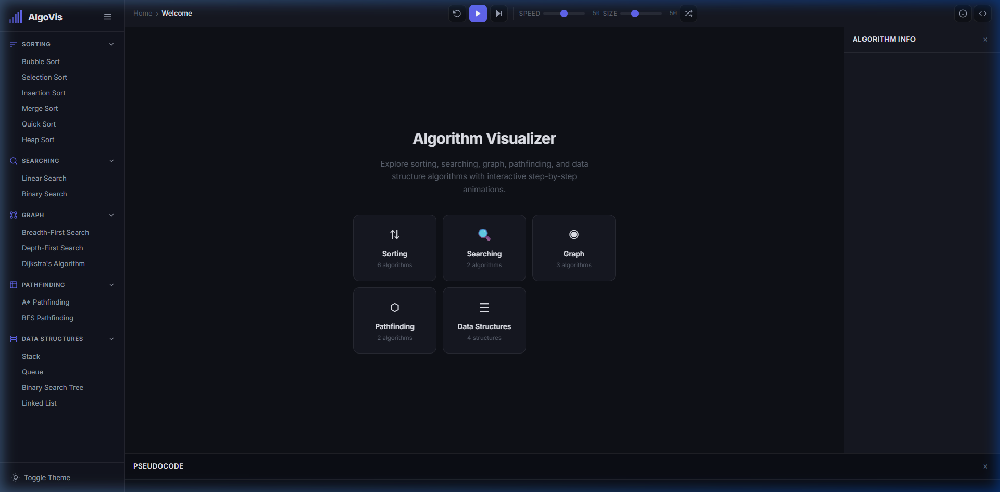
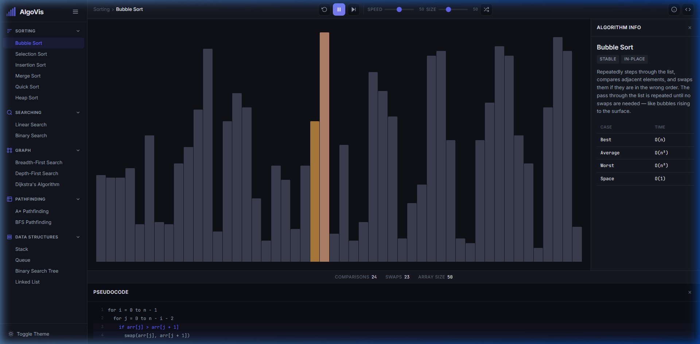
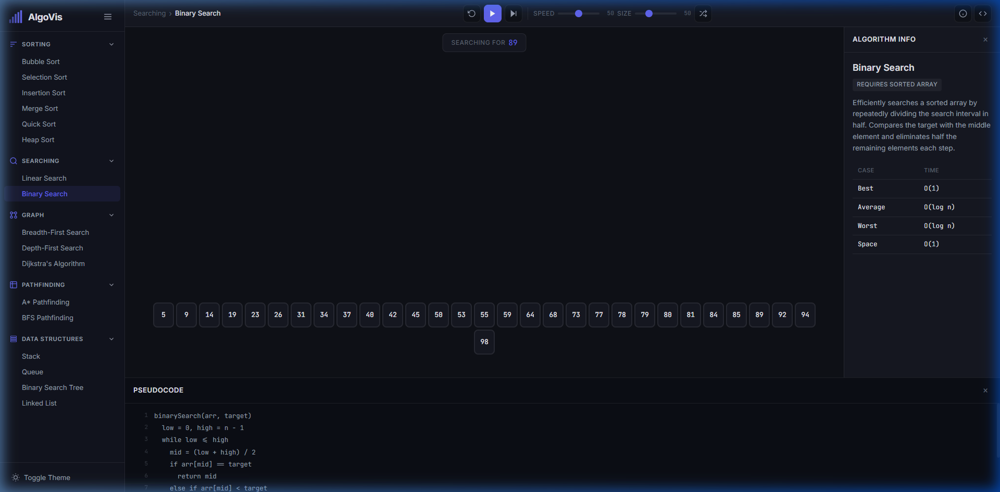
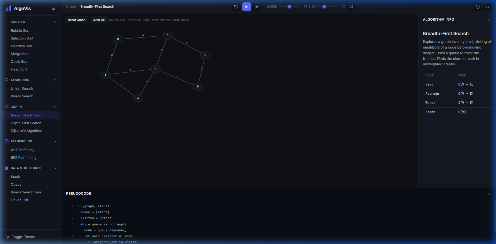
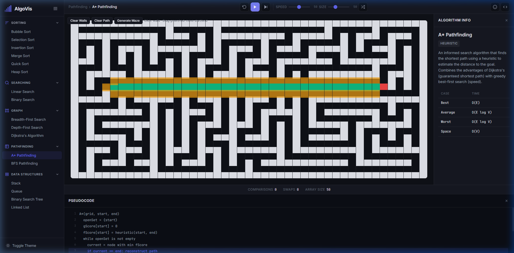

# Algorithm Visualizer

An interactive web app for visualizing sorting, searching, graph, pathfinding, and data structure algorithms with step-by-step animations.

Built with **Vite + vanilla JavaScript** — no frameworks, no dependencies beyond the dev server.

Artificial Intelligence has been used to beautify and streamline some aspects of the application.



---

## Algorithms

### Sorting
Bubble Sort, Selection Sort, Insertion Sort, Merge Sort, Quick Sort, Heap Sort



### Searching
Linear Search, Binary Search



### Graph Traversal
BFS, DFS, Dijkstra's Shortest Path



### Pathfinding
A* (Manhattan heuristic), BFS Grid — with recursive backtracker maze generation



### Data Structures
Stack (push/pop), Queue (enqueue/dequeue), Binary Search Tree (insert/search), Linked List (insert/delete)

---

## Features

- **Step-by-step animation** — play, pause, step forward, reset
- **Speed and size controls** — adjustable via sliders
- **Live pseudocode** — active line highlighted in sync with the animation
- **Stats tracking** — comparisons and swaps counted in real-time
- **Interactive graph canvas** — double-click to add nodes, right-click to connect, drag to reposition
- **Pathfinding grid** — click to draw walls, drag start/end points, generate mazes
- **Dark / light theme** — toggle with persistence via localStorage
- **Keyboard shortcuts** — Space (play/pause), → (step), R (reset), G (generate), I (info panel), C (code panel)

---

## How It Works

Each algorithm is implemented as a **generator function** that yields visual "frames" (e.g. compare, swap, visit). The animation engine consumes these frames at a configurable speed using `requestAnimationFrame`. This makes pause, step, and resume trivial.

Algorithms have zero knowledge of the DOM. Visualizers subscribe to frames and update the UI accordingly.

```
src/
├── core/           # Animator, state management, router
├── algorithms/     # Pure generator functions (sorting, searching, graph, pathfinding)
├── visualizers/    # DOM/canvas renderers that consume generators
├── data/           # Algorithm metadata (descriptions, complexities, pseudocode)
├── styles/         # CSS custom property design system with dark/light themes
└── main.js         # App bootstrap, sidebar, controls, route registration
```

---

## Setup

```bash
npm install
npm run dev
```

Opens at `http://localhost:3000`.

---

## Build

```bash
npm run build
npm run preview
```

Output goes to `dist/`.

---

## Tech Stack

| Layer | Choice |
|-------|--------|
| Bundler | Vite |
| Language | Vanilla JavaScript (ES2022+) |
| Styling | CSS custom properties |
| Rendering | DOM (bars, blocks, trees) + Canvas (graphs) |
| Fonts | Inter, JetBrains Mono |

---

## License

MIT
